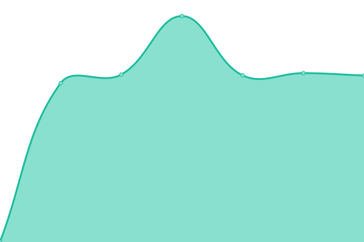

# [📈 Live Status](https://santiagolator.github.io/upptime): <!--live status--> **🟧 Partial outage**

This repository contains the open-source uptime monitor and status page for [Santiago Lator](https://flowcv.me/santiago-lator), powered by [Upptime](https://github.com/upptime/upptime).

With [Upptime](https://upptime.js.org), you can get your own unlimited and free uptime monitor and status page, powered entirely by a GitHub repository. We use [Issues](https://github.com/santiagolator/upptime/issues) as incident reports, [Actions](https://github.com/santiagolator/upptime/actions) as uptime monitors, and [Pages](https://santiagolator.github.io/upptime) for the status page.

<!--start: status pages-->
<!-- This summary is generated by Upptime (https://github.com/upptime/upptime) -->
<!-- Do not edit this manually, your changes will be overwritten -->
<!-- prettier-ignore -->
| URL | Status | History | Response Time | Uptime |
| --- | ------ | ------- | ------------- | ------ |
|  [o11y.space](https://o11y.space/) | 🟩 Up | [o11y-space.yml](https://github.com/santiagolator/upptime/commits/HEAD/history/o11y-space.yml) | 

 1559ms
     
 | 

<a href="https://santiagolator.github.io/upptime/history/o11y-space">100.00%</a>
    

|  [wiki.o11y.space](https://wiki.o11y.space/) | 🟥 Down | [wiki-o11y-space.yml](https://github.com/santiagolator/upptime/commits/HEAD/history/wiki-o11y-space.yml) | 

 0ms
     
 | 

<a href="https://santiagolator.github.io/upptime/history/wiki-o11y-space">0.00%</a>
    

<!--end: status pages-->

[**Visit our status website →**](https://santiagolator.github.io/upptime)

## 📄 License

- Powered by: [Upptime](https://github.com/upptime/upptime)
- Code: [MIT](./LICENSE) © [Santiago Lator](https://flowcv.me/santiago-lator)
- Data in the `./history` directory: [Open Database License](https://opendatacommons.org/licenses/odbl/1-0/)
